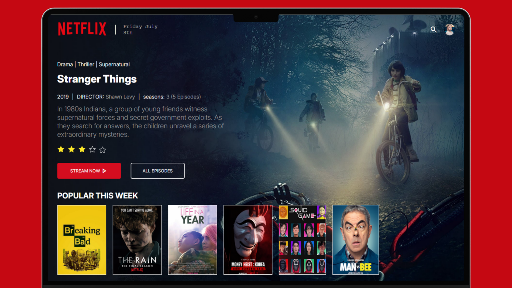

# 🎬 Netflix Layout Clone  

Este projeto recria o **layout da Netflix** utilizando apenas **HTML e CSS**.  
O objetivo é praticar **estruturação semântica de páginas** e **estilização responsiva**, sem uso de JavaScript.

---

## 📸 Demonstração  
  

---

## 🔗 Acesse o Projeto  
👉 [Clique aqui para ver online](https://geovaneibi.github.io/layout-Netflix/)  

---

## 🛠 Tecnologias Utilizadas  
- **HTML5**  
- **CSS3**  
